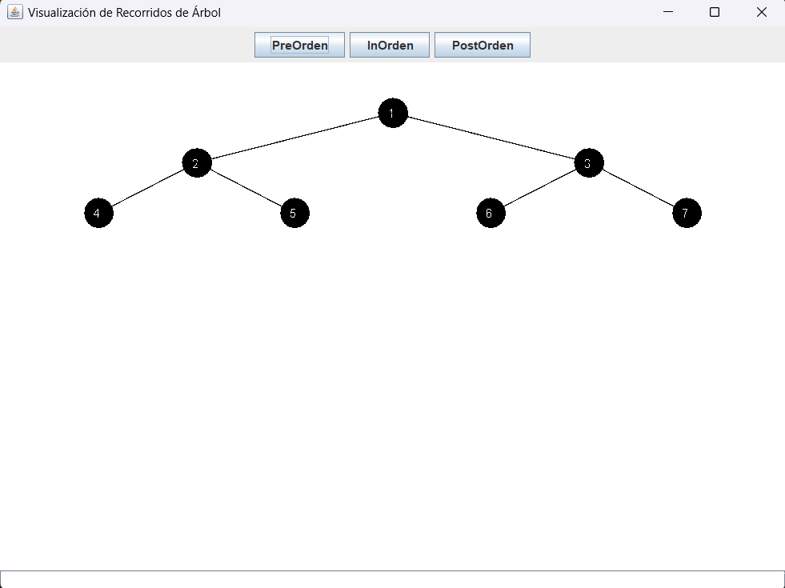
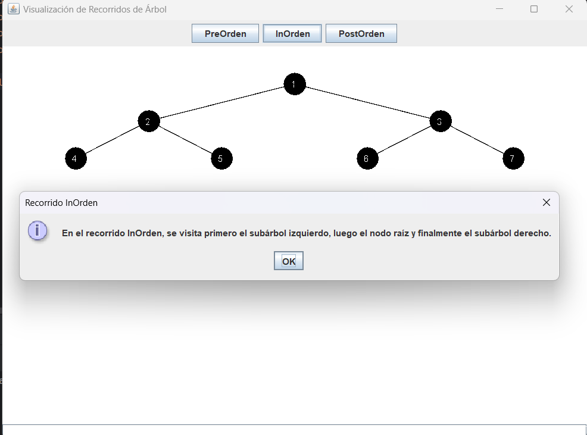
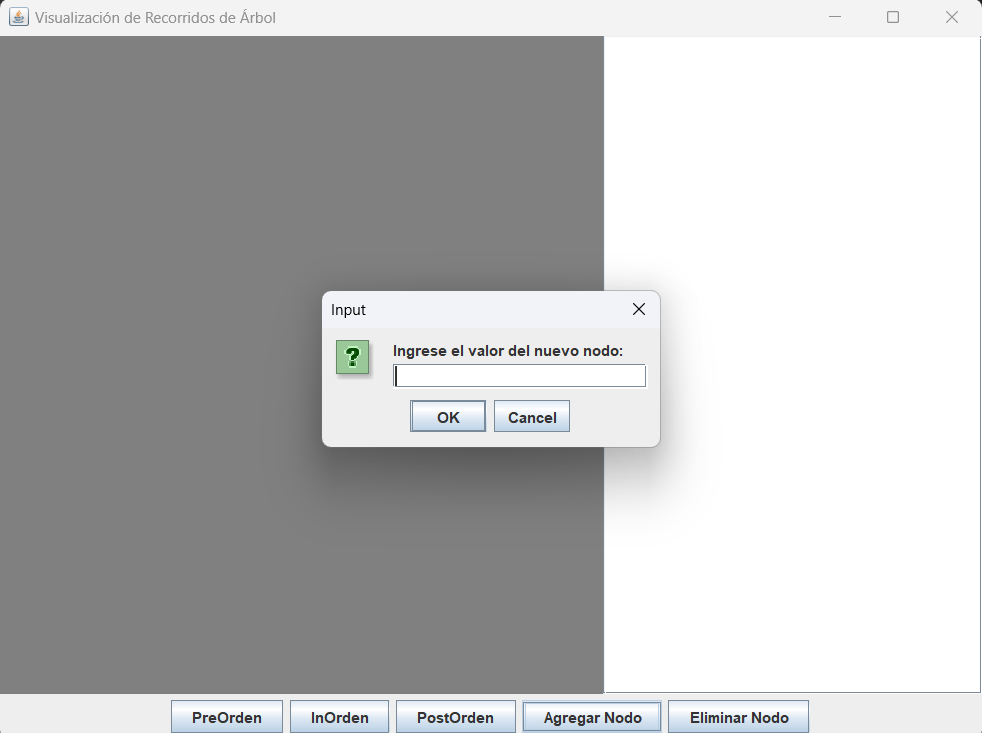
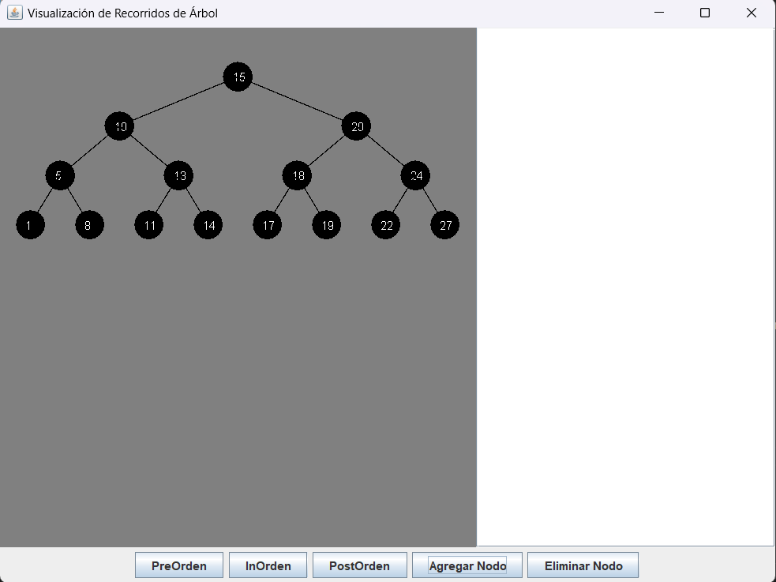
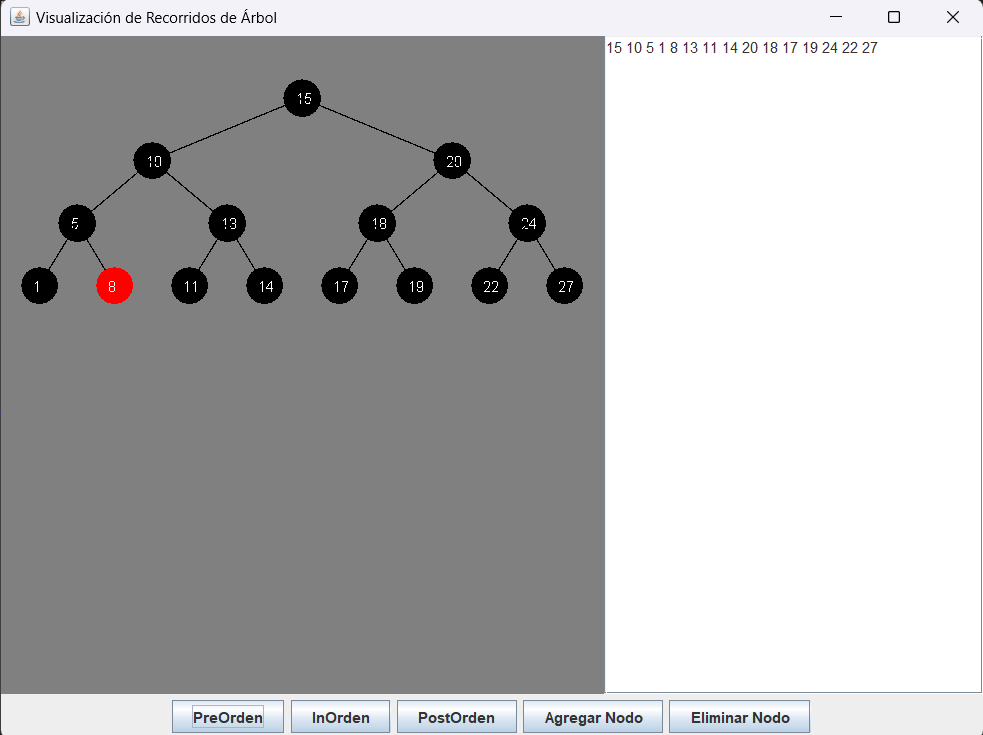

# GraficaArbolBinario

En el presente repositorio se entrega parte del codigo de arboles binarios, presentando una interfaz del escritorio donde evidenciaremos por medio de una linea de texto los recorridos presentes para arboles binarios:

# Interfaz del codigo:

se puede evidenciar tres botones siendo los recorridos que tomara el arbol, al momento de presionar alguno de ellos primero presentara un mensaje dando a conocer como funciona cierto reccorrido de manera sencilla y corta:

Luego de ello mostrara el recorrido en la parte baja del programa:

# Informacion de actualizacion:

Se implemento nueva informacion del codigo, ahora se puede añadir y eliminar nodos, de igual manera se evidenciara el recorrido de forma grafica, el codigo actualizado esta en la rama ¨Features¨.

# Interfaz actualizada:

