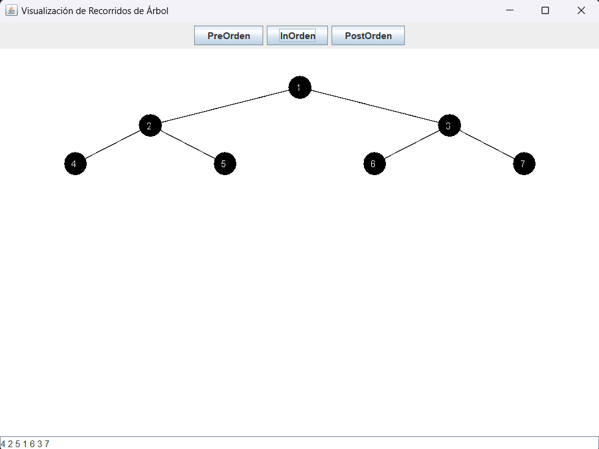

# GraficaArbolBinario

En el presente repositorio se entrega parte del codigo de arboles binarios, presentando una interfaz ded escritorio donde evidenciaremos por medio de una linea de texto los recorridos presentes para arboles binarios:

# Interfaz del codigo:

se puede evidenciar tres botones siendo los recorridos que tomara el arbol, al momento de presionar alguno de ellos primero presentara un mensaje dando a conocer como funciona cierto reccorrido de manera sencilla y corta:

Luego de ello mostrara el recorrido en la parte baja del programa:

